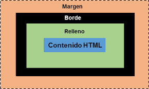

# **Concepto de Modelo de Caja HTML**
## *Rogelio Zamarripa Treviño - 18100248 - Carrera: Ingeniería en Sistemas Computacionales*
#### Forma en la que se representan todos los elementos HTML dentro de una página web. Todo elemento dentro de una página web tiene una caja alrededor, y saber sobre estas cajas es muy importante a la hora de querer crear un diseño para una página o querer agrupar ciertos elementos de esta. Se clasifican en **cajas en línea** y **cajas en bloque**.

#### *Ejemplo de Modelo de Caja*  
  
  #### Los modelos de caja contienen las siguientes propiedades:
1. **Width**: Ancho total de la caja. En este caso el ancho total no consiste únicamente del ancho del **elemento/contenido HTML**, sino que es una suma del ancho del **contenido**, el **relleno**, **borde** y **margen**. Se consideran tanto el lado izquierdo como el derecho del contenido.
2. **Height**: Altura total. Ocurre la misma situación que con el ancho total, en el sentido de que es el resultado de la suma de la altura del **contenido**, el **relleno** superior e inferior, el **borde** superior e inferior y el **margen** completo.
3. **Padding**: El área de **padding** es el espacio entre el contenido del elemento y su borde. Es una propiedad que no permite valores negativos y con ella se puede establecer el espacio de relleno requerido por todos los lados de un elemento.
4. **Margin**: Distancia desde el borde de un elemento hacia otro.
5. **Border**: Es una línea entre el **relleno/background** y el **margen**.
6. **Background**: Imágen o color de fondo/relleno que ocupará todo el elemento desde los bordes. Espacio que existe entre el **borde** y el **contenido**.
7. **Content**: El propio elemento HTML.
