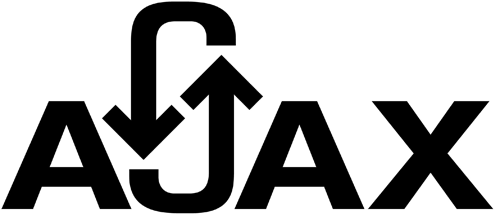
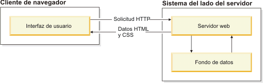
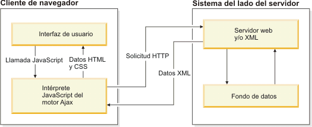
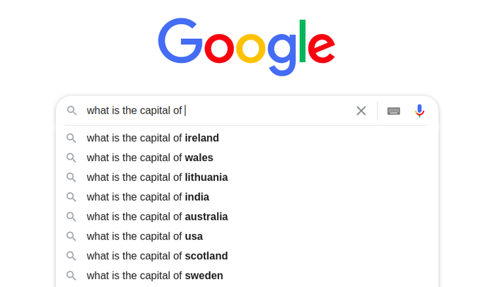

# **¿Qué es AJAX y cómo funciona?**
## *Rogelio Zamarripa Treviño - 18100248 - Carrera: Ingeniería en Sistemas Computacionales*
#### **AJAX** significa "**JavaScript asíncrono y XML**" (**Asynchronous JavaScript and XML**, en inglés), y éste consiste de un conjunto de técnicas de desarrollo web que permiten que las aplicaciones web funcionen de forma asíncrona, procesando cualquier solicitud al servidor en segundo plano.

#### Dicho en términos menos complejos, AJAX no se trata de una sola tecnología, ni mucho menos un solo lenguaje de programación, sino de varias tecnologías de desarrollo web que permiten que las aplicaciones funcionen y que envíen y recuperen datos de un servidor, sin tener que cargar una página web. Permite intercambiar datos con un servidor de manera sencilla, además de interactuar con un sitio web, sin tener que recargarlo.

#### AJAX se compone de las siguientes tecnologías:
* **HTML/XHTML**, para el lenguaje principal y **CSS** para la presentación.
* **El Modelo de Objetos del Documento (DOM, Document Object Model)**, para visualizar e interactuar de forma dinámica la información presentada.
* El objeto **XMLHttpRequest** para manipular los datos de forma asíncrona con el servidor web.
* **XML** para el _intercambio_ de datos, y **XSLT** para su _manipulación_. Muchos desarrolladores han comenzado a reemplazarlo por **JSON** porque es más similar al lenguaje de programación **JavaScript**.
* Y finalmente, el lenguaje de programación **JavaScript** para unir todas estas tecnologías. Además, **AJAX** utiliza **JavaScript** para poder modificar los contenidos de una página de manera rápida y dinámica.

#### En una aplicación web tradicional, las solicitudes **HTTP**, que se inician mediante la interacción del usuario con la interfaz web, se realizan a un **servidor web**. El **servidor web** procesa la solicitud y devuelve una **página HTML** al cliente. Durante el transporte **HTTP**, el usuario no puede interactuar con la aplicación web. 

#### Esta no es la situación en una aplicación web **AJAX**. En estas, no se interrumpe el usuario en interacciones con la aplicación web. El motor de **AJAX**, o el intérprete **JavaScript**, permite que el usuario interactúe con la aplicación web independientemente del transporte **HTTP** procedente del servidor o que tenga el servidor como destino representando la interfaz y gestionando las comunicaciones con el servidor en nombre del usuario. 

#### Uno de los ejemplos prácticos de AJAX más conocidos es la _función de autocompletado_ del buscador **Google**. Esta nos ayuda a completar las palabras clave mientras las escribimos. Las palabras clave cambian en tiempo real, sin embargo, la página como tal sigue siendo la misma. Se podría decir que una de las mayores ventajas de usar AJAX es que optimiza la experiencia del usuario, ya que éste no tendría que esperar mucho tiempo para acceder al contenido del sitio web (cada nueva palabra clave, recomendación o sugerencia).

#### Otros ejemplos del uso de las tecnologías **AJAX** pueden ser: _las salas de chat_, _la sección de notificación de tendencias en Twitter_ y _los sistemas de votación y/o calificación_.